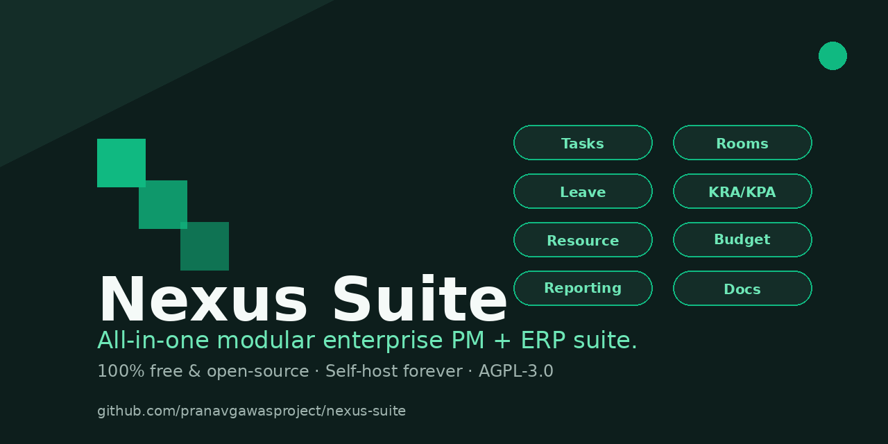

<div align="center">



# Nexus Suite

**All-in-one modular enterprise PM + ERP suite. 100% free and open-source — self-host forever.**

[](LICENSE)
[](https://github.com/pranavgawasproject/nexus-suite/actions/workflows/ci.yml)
[](docs/PRD.md)
[](docs/SELF_HOSTING.md)
[](https://github.com/pranavgawasproject/nexus-suite)

[Quickstart](#quickstart) · [Modules](#modules) · [Why Nexus Suite](#why-nexus-suite) · [Self-hosting](docs/SELF_HOSTING.md) · [Public API](docs/API.md) · [Status](status/PROJECT_STATUS.md)

</div>

---

## The pitch in one paragraph

Organizations currently stitch together 3–5 separate tools to run their operations — a PM tool (Jira/Asana), an HR tool (Keka/Lattice), a room booking tool (Robin/Skedda), a budget spreadsheet, and a chat tool. Nexus Suite replaces all of them with **one modular platform** where every module is independently toggleable, sharing one core (users, org, auth, notifications, audit). And unlike every other "all-in-one" tool out there, it's **genuinely free and open-source under AGPL-3.0** — not freemium, not a 14-day trial. Self-host it forever, or let us host it for you.

---

## Why Nexus Suite

|  | Closed SaaS (Monday/Asana/Jira) | Open-source ERP (Odoo/ERPNext) | **Nexus Suite** |
|---|---|---|---|
| Pricing | Per-seat, compounds with headcount | Free, but configuration-heavy | **Free forever, flat-rate managed hosting** |
| Module model | Fixed bundle | Monolithic, install apps you don't need | **Toggle per module — disable what you don't use** |
| ERP depth | None | Deep (accounting, inventory, manufacturing) | **PM + HR + facilities + budget — the SME middle** |
| Self-host | ❌ No (and even if you could, license forbids) | ✅ Yes, but heavy setup | **✅ One-command `docker compose up`** |
| Open-source | ❌ Closed | ✅ GPL | **✅ AGPL-3.0 (network-use protected)** |
| Set up in <1 day | ❌ Multi-week sales cycle | ❌ Multi-week implementation | **✅ Self-host in 2 minutes** |

**The wedge:** pre-built modules, toggled per org, self-hosted in minutes, genuinely free — not a feature-count race against Odoo's 260+ modules.

---

## Modules

All 10 modules ship free and open-source. Toggle individually per org.

| # | Module | Status | Description |
|---|---|---|---|
| 1 | **Tasks & Projects** | ✅ Live | Kanban + list, priorities, types, assignees, due dates, estimates, dependencies |
| 2 | **KRA / KPA & Performance** | ✅ Live | KRA lifecycle (draft → self → manager → calibration → closed), ratings + comments |
| 3 | **Meeting Room & Resource Booking** | ✅ Live | Room inventory, conflict-free calendar, recurring bookings, amenities |
| 4 | **Resource & Capacity** | ✅ Live | Per-user allocation %, workload view, over-allocation detection |
| 5 | **Budget & Financial Tracking** | ✅ Live (INR) | Project budgets, expense logging, budget vs actual, category breakdown |
| 6 | Risk & Issue Management | 🔜 Phase 3 | Risk register (likelihood × impact), issue log, change requests |
| 7 | **Collaboration & Docs** | ✅ Live (docs) | Markdown wiki with versioning, nested pages, public/guest sharing |
| 8 | **Leave & Attendance** | ✅ Live | Leave requests with approval workflow, check-in/out, holiday calendar |
| 9 | **Reporting & Analytics** | ✅ Live | Cross-module KPIs, charts, graceful hiding for disabled modules |
| 10 | Governance, Compliance & Audit | 🔜 Phase 3 | Advanced audit export, e-signature, retention policies, IP allowlisting |

**Status legend:** ✅ Live · 🔜 Phase 3 (per [PRD §10](docs/PRD.md))

---

## Quickstart

### Self-host (2 minutes)

```bash
git clone https://github.com/pranavgawasproject/nexus-suite.git
cd nexus-suite

export NEXTAUTH_SECRET=$(openssl rand -base64 32)

docker compose up -d --build
# Open http://localhost:3000 — done.
```

The first request auto-seeds a demo org ("Acme Design Studio") with 5 users, 3 projects, 12 tasks, 4 rooms, 7 bookings, plus sample data for every other enabled module. Log in with any demo user (e.g. `priya@acme.test`) — passwords aren't enforced in the demo flow.

👉 **Full self-hosting guide (Postgres + backups + reverse proxy):** [`docs/SELF_HOSTING.md`](docs/SELF_HOSTING.md)

### Local development

```bash
bun install
cp .env.example .env
bun run db:push     # apply schema + seed demo data
bun run dev         # http://localhost:3000
```

---

## Architecture

- **Multi-tenancy:** row-level (`orgId` on every table) — see [`prisma/schema.prisma`](prisma/schema.prisma)
- **Modular toggle system:** every module is a self-contained unit with its own DB schema + API routes + UI section. Disabled modules return `403 Module Not Enabled` from their API (not `404`) — see [PRD §4.5](docs/PRD.md).
- **Public API:** RESTful `/api/v1/*` with API-key auth (read/write/webhooks scopes) + HMAC-signed webhooks with retry-with-backoff — see [`docs/API.md`](docs/API.md).
- **Notifications:** central cross-module notification service consumed by all modules — see [PRD §5.5](docs/PRD.md).
- **Tests:** 17 tenant-isolation tests covering orgId coverage, cross-org leak prevention, audit/notification integrity — see [`tests/tenant-isolation.test.ts`](tests/tenant-isolation.test.ts). Run with `bun run test`.

### Tech stack

- **Framework:** Next.js 16 (App Router, Turbopack) + TypeScript 5
- **DB:** Prisma ORM + SQLite (MVP) / PostgreSQL (production) — swap via `DATABASE_URL`
- **UI:** Tailwind CSS 4 + shadcn/ui (New York) + Recharts + dnd-kit + Framer Motion
- **Auth:** NextAuth.js v4 (Credentials provider, JWT sessions, bcrypt-hashed passwords)
- **State:** Zustand (client) + TanStack Query (server)
- **Validation:** zod on every API request body
- **Runtime:** Bun (dev + scripts), Node.js (production standalone)

---

## Business model: open-core

Per [PRD v2.1 §6](docs/PRD.md), Nexus Suite is **open-core** — not freemium:

- **Free forever (AGPL-3.0):** all 10 modules, full features, unlimited users, unlimited orgs, full public API + webhooks, self-host deployment kit
- **Paid (Managed Cloud Hosting):** we host it for you — infra, backups, upgrades, uptime SLA. Flat per-org pricing (not per-seat).
- **Paid (Support plans):** guaranteed response times, direct support channel
- **Paid (Compliance add-ons):** SOC2 reports, signed DPAs, dedicated data residency

**Hard rule:** paid tiers only sell hosting/support/compliance — never module features. Bait-and-switch kills community trust.

---

## Roadmap

See [`status/PROJECT_STATUS.md`](status/PROJECT_STATUS.md) for live status.

- ✅ **Phase 1 MVP:** Core, Tasks, Rooms, Reporting, Marketplace, Onboarding, Export, Audit
- ✅ **Phase 2:** Leave & Attendance, Resource & Capacity, KRA/KPA, Budget (INR), Docs
- 🔜 **Phase 2 remaining:** Public API + webhooks (✅ built), Slack/Teams integration, CSV import wizard
- 🔜 **Phase 3:** Risk module, Governance UI, multi-currency + GST engine, SAML/OIDC, advanced BI, native mobile, i18n
- 🔜 **AI integration:** task summarization, smart resource allocation, NL task creation, chat-based room booking — ships in the free core per [PRD §16](docs/PRD.md)

---

## Contributing

See [`CONTRIBUTING.md`](CONTRIBUTING.md) and [`CODE_OF_CONDUCT.md`](CODE_OF_CONDUCT.md). PRs welcome!

---

## License

**AGPL-3.0-or-later** — see [`LICENSE`](LICENSE).

You're free to self-host, modify, and redistribute Nexus Suite commercially, provided that if you expose the service to users over a network (AGPL §13), you keep the source code open.

This license choice (over MIT) is deliberate: it prevents competitors from re-hosting Nexus Suite as their own SaaS without contributing back — protecting the open-core business model documented in [PRD §6](docs/PRD.md).

---

<div align="center">

Built in India 🇮🇳 · [PRD v2.1](docs/PRD.md) · [Status](status/PROJECT_STATUS.md) · [Self-hosting guide](docs/SELF_HOSTING.md)

</div>
